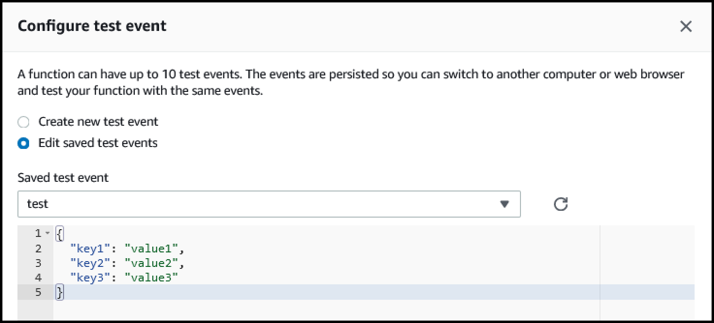
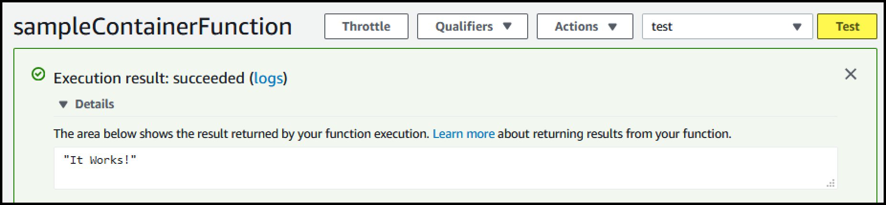

Lambda Function from Container
==============================
* Provisioning A Lambda function from a Container allows the establishment of a standardized Container-based build, and deployment, pipeline.

* The **Container Image** is defined in `app.py`. 
  * If `use_pre_existing_image` is **True**, then it is expected that a **Container Image** was **created elsewhere** and will be used by this CDK code.
  * If `use_pre_existing_image` is **False**, then a new container will be created using the `Dockerfile` from the the `lambda-image` sub-directory.

* After deploying the **Lambda Function**, go to the **Lambda Dashboard**, open the **Lambda Function**, and **configure a test event**.



* After running the **test event**, the **output** should be from the **Lambda Function code** compiled in to the **Container Image**.



### Create Python Virtual Environment

```bash
python3 -m venv .venv
source .venv/bin/activate
```

### Install Python-specific modules

* Each service such as **lambda** _(`aws_cdk.aws_lambda`)_ or **ec2** _(`aws_cdk.aws_ec2`)_, has its own module which must be defined in `requirements.txt`.

```bash
pip3 install -r requirements.txt
```

### Create Cloudformation from CDK

```bash
cdk synth
```

#### View the generated Cloudformation
```bash
cat cdk.out/LambdaContainerFunctionStack.template.json
```

### Deploy
```bash
cdk deploy
```


